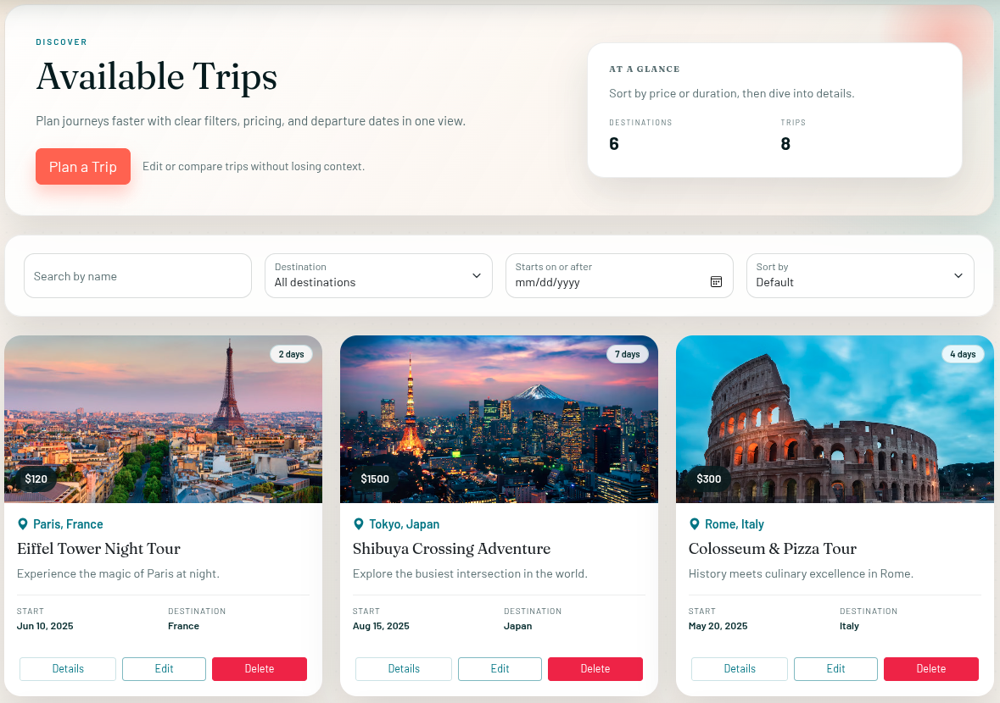
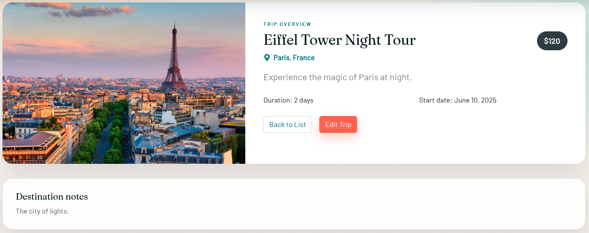

<h1 align="center">Projet MEAN Voyage — Travel Agency CRUD</h1>

<p align="center">
	
	
	
	
	
</p>

<p align="center">
	A MEAN stack travel agency app to manage destinations and trips with full CRUD operations.
	Browse destinations, build trip itineraries, and manage pricing, dates, and descriptions from a clean Angular UI.
</p>

---

## Table of Contents

| Section | Description |
|---------|-------------|
| [About](#about) | Project overview and goals |
| [Features](#features) | Key capabilities |
| [Tech Stack](#tech-stack) | Frontend and backend tools |
| [Project Structure](#project-structure) | High-level layout |
| [Getting Started](#getting-started) | Setup and installation |
| [API Endpoints](#api-endpoints) | CRUD routes |
| [Screenshots](#screenshots) | UI preview |
| [Contributing](#contributing) | Contribution guidelines |
| [License](#license) | License information |
| [Contact](#contact) | Maintainer details |

---

## About

Projet MEAN Voyage is a full-stack travel agency CRUD application. It provides an Angular front end for creating, updating, and browsing trips and destinations, backed by a Node.js/Express API with MongoDB for persistence.

## Features

- Create, edit, and delete trips and destinations
- Detailed trip view with pricing, dates, and descriptions
- Destination catalog with rich descriptions
- Responsive UI styled with Bootstrap
- SweetAlert2 feedback for user actions

## Tech Stack

**Frontend**
- Angular 17
- TypeScript
- Bootstrap 5
- RxJS

**Backend**
- Node.js
- Express 5
- MongoDB with Mongoose
- dotenv + CORS

## Project Structure

```
backend/     Express API, MongoDB models, routes, controllers
frontend/    Angular app (components, services, routes)
images/      README screenshots
```

## Getting Started

### Prerequisites

- Node.js (LTS)
- npm
- MongoDB (local) or MongoDB Atlas

### 1) Clone the repository

```bash
git clone https://github.com/Khaledblel/projet-mean-voyage.git
cd projet-mean-voyage
```

### 2) Backend setup

```bash
cd backend
npm install
```

Create a `.env` file inside `backend/`:

```
MONGO_URI=mongodb://127.0.0.1:27017/mean_voyage
PORT=3000
```

Start the API server:

```bash
node app.js
```

Optional for development:

```bash
npx nodemon app.js
```

### 3) MongoDB (local or Atlas)

**Local MongoDB**
- Ensure MongoDB is running
- Use a local connection string in `MONGO_URI`

**MongoDB Atlas (optional)**
- Create a cluster and database user
- Whitelist your IP and copy the connection string
- Replace `MONGO_URI` with your Atlas connection string

### 4) Frontend setup

```bash
cd ../frontend
npm install
npm start
```

Open the app at `http://localhost:4200`.

## API Endpoints

| Resource | Method | Endpoint | Description |
|----------|--------|----------|-------------|
| Trips | GET | `/api/trips` | List all trips |
| Trips | POST | `/api/trips` | Create a trip |
| Trips | GET | `/api/trips/:id` | Get trip details |
| Trips | PUT | `/api/trips/:id` | Update a trip |
| Trips | DELETE | `/api/trips/:id` | Delete a trip |
| Destinations | GET | `/api/destinations` | List all destinations |
| Destinations | POST | `/api/destinations` | Create a destination |
| Destinations | GET | `/api/destinations/:id` | Get destination details |
| Destinations | PUT | `/api/destinations/:id` | Update a destination |
| Destinations | DELETE | `/api/destinations/:id` | Delete a destination |

## Screenshots

<table>
	<tr>
		<td align="center" width="50%">
			<br>
			<strong>Trips List</strong><br>
			<sub>Browse and manage available trips</sub>
		</td>
		<td align="center" width="50%">
			<br>
			<strong>Trip Details</strong><br>
			<sub>View trip information and itinerary details</sub>
		</td>
	</tr>
</table>

## Contributing

1. Fork the repository
2. Create a feature branch (`git checkout -b feature/your-feature`)
3. Commit your changes (`git commit -m "Add feature"`)
4. Push to the branch (`git push origin feature/your-feature`)
5. Open a Pull Request

## License

MIT

## Contact

- GitHub: https://github.com/Khaledblel

<p align="center">
	<a href="#projet-mean-voyage--travel-agency-crud">Back to Top</a>
</p>